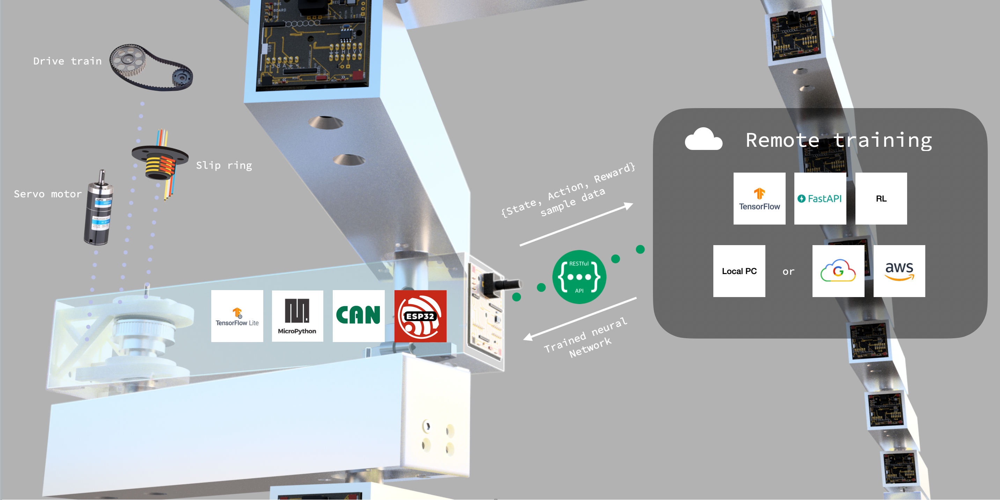

# Introduction

An open source 'industrial servo motor' which employs Reinforcement Learning to train itself how best to drive a load. The user can decide in this case what is meant by 'best', e.g. speed, accuracy or energy efficiency. The model is run locally on a low cost microcontroller (i.e. ESP32), but is trained remotely where more computational resources are available (e.g. in the cloud).

# Project status

We are currently in early prototyping phase, and are exepecting to be able to have the project in a state where other people can pick up a servo and run with it by the end of 2019. In the mean time if you would like to get involved with development and prototyping then please get in touch via elliot@kimchiandchips.com.

# Architecture

* Server
  * High performance hardware (e.g. desktrop CPU + GPU)
  * FastAPI REST service
  * TensorFlow implemented RL algorithms (e.g. DDPG / NAF)
* Client
  * Low cost hardware (e.g. ESP32 microcontroller)
  * MicroPython
  * [TensorFlow Lite module](https://github.com/elliotwoods/micropython/tree/elliot-modules/modules/tensorflow)
  * (download model from server, run actor, gather samples, send to server) : repeat

## Prior work

Muscle Memory builds on the work of previous projects, most notably [Mechaduino](https://github.com/jcchurch13/Mechaduino-Firmware) by Tropical Labs.

# Credits

Muscle Memory is a project of Kimchi and Chips art studio, and is partly funded by the Arts Council of Korea via the State, Action, Reward project.
